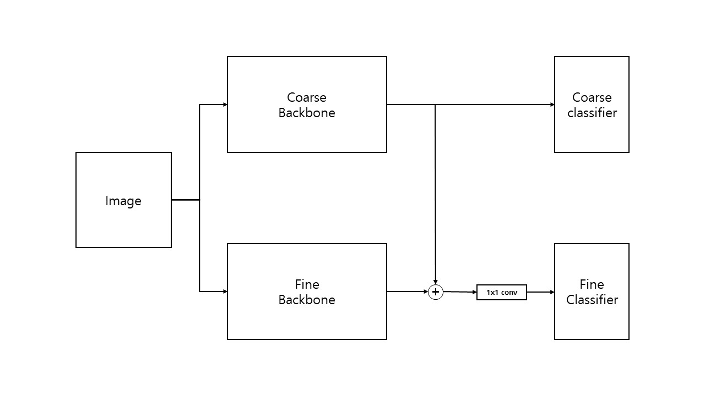

# Hierarchical_CNN

## Environment
- torch : 1.8.2+cu111
- torchvision : 0.9.2+cu111
- torchmetrics : 0.10.0
- numpy : 1.21.2
- wandb : 0.13.2
```
pip install -r requirements.txt
```
## Dataset
- [Cifar100](https://www.cs.toronto.edu/~kriz/cifar.html)
    - Use Superclass for Coarse label
    - Use Classes for Fine label
```
python preprocess.py --dataset cifar100 --data_dir "data_dir" --types train,test
```

## Architecture

- Backbone : [Wide_ResNet_50](https://arxiv.org/abs/1605.07146)
    - Coarse : Using WRN50 Backbone expcet for `layer4`
    - Fine : Using whole WRN50 Backbone
- Main Goal is training Fine Label Classification
- Concatenating Coarse feature and Fine feature
- Using `1x1conv` layer for matching channel after concatenating
- Simply Using Fc layer for Classifier

## Training (in progress)
```
The following hyperparameters are not the best ones.
The model is still training.
```
- `optimizer` : `SGD`
    - or you can use `Adam`
- `batch_size` : `32`
- `coarse` : `1`, `fine` : `2`
    - setting different Loss Weight
    - Coarse : Fine = 1 : 2
- `epochs` : `15`
- `lr` : `8e-3`
- `lr_scheduler` : `ReduceLROnPlateau`
    - or you can use `MultiStepLR` with using `milestones` argument

### optimizing model
- Using `wandb.sweep`


Reference : [Hierarchical image classification in CNNs](http://cs229.stanford.edu/proj2019spr/report/18.pdf)